# Architecture Document

## ADD Plan Table

| Iteration | Goal/Driver | Elements to Refine | Design Concepts | Notes |
|-----------|-------------|--------------------|-----------------|-------|
| 1         | Performance (QA-1) | Query Service | CQRS, Caching | Focus on high-performance query handling. |
| 2         | Reliability (QA-2) | Event Bus | Event Sourcing, Reliable Messaging | Ensure reliable price updates and synchronization. |
| 3         | Scalability (QA-4) | Read Model | Horizontal Scaling, Load Balancing | Enable independent scaling of the read side. |
| 4         | Cloud-Native (CON-6) | Deployment Architecture | Microservices, Managed Services | Leverage cloud-native patterns and services. |
| 5         | Modular Structure (CRN-1) | Service Interfaces | API Gateway, Service Mesh | Establish clear modular boundaries and interfaces. |
| 6         | Maintainability | Monitoring & Logging | Observability, Centralized Logging | Ensure system maintainability and operational insights. |

## Initial C4 Context Description

The Hotel Pricing System (HPS) is a cloud-native platform designed to manage and query room prices across various booking platforms. It handles high-concurrency updates and massive query volumes from external travel agencies.

### System Context Diagram

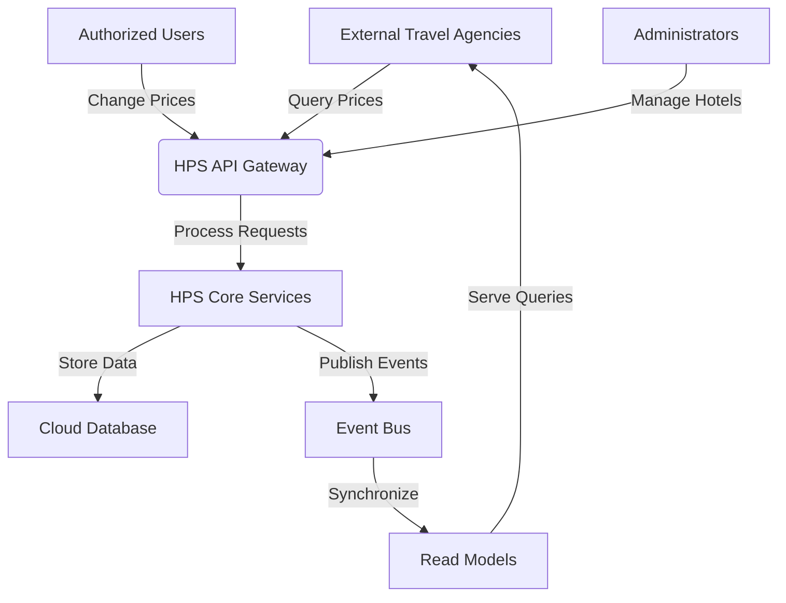

### Key Components
- **External Travel Agencies**: Systems querying current pricing.
- **Authorized Users**: Users updating room rates.
- **Administrators**: Users managing hotel profiles.
- **HPS API Gateway**: Entry point for all external requests.
- **HPS Core Services**: Main processing logic for handling requests.
- **Cloud Database**: Persistent storage for hotel and pricing data.
- **Event Bus**: Ensures reliable event-driven communication.
- **Read Models**: Optimized data views for fast query responses.

### Rationale
The initial context focuses on establishing a high-level understanding of the system's interactions with external entities and internal components. The ADD Plan Table prioritizes performance, reliability, and scalability, aligning with the primary quality attribute drivers and constraints.

---

**PAUSE for Review**: Please review the ADD Plan Table and Initial C4 Context Description before proceeding to the next steps.

---

# Iteration 1 | Step 2

# Architecture Document

## ADD Iteration 1

### Step 2: Establish Iteration Goal by Selecting Drivers

**Iteration Goal**: Enhance system performance, specifically focusing on the query service to ensure it meets the performance quality attribute driver (QA-1).

**Selected Driver**: 
- **Performance (QA-1)**: The system must respond to price queries within 200ms, even during peak traffic loads.

**Rationale**: 
The query service is critical for handling high volumes of requests from external travel agencies. Ensuring high performance in this area is essential to meet the system's performance requirements and provide a seamless experience for users querying room prices.

---

**PAUSE for Review**: Please review the established iteration goal and selected drivers before proceeding to the next steps.

---

# Iteration 1 | Step 3

# Architecture Document

## ADD Iteration 1

### Step 3: Choose Elements of the System to Refine

**Element to Refine**: Query Service

**Rationale**: 
The Query Service is a critical component responsible for handling requests from external travel agencies to retrieve current pricing information. Given the performance goal of responding to queries within 200ms, refining this element is essential to ensure it can efficiently handle high volumes of concurrent requests.

### Current State of the Query Service

- **Functionality**: Provides pricing information to external travel agencies.
- **Performance Requirement**: Must respond to queries within 200ms.
- **Current Challenges**: Potential bottlenecks in data retrieval and processing speed.

### Refinement Focus

- **Data Access Optimization**: Ensure that data retrieval is optimized for speed.
- **Caching Strategy**: Implement caching mechanisms to reduce database load and improve response times.
- **Scalability Considerations**: Prepare the service for horizontal scaling to handle increased load.

---

**PAUSE for Review**: Please review the chosen elements for refinement and the rationale before proceeding to the next steps.

---

# Iteration 1 | Step 4

# Architecture Document

## ADD Iteration 1

### Step 4: Choose Design Concepts (Patterns/Tactics)

**Design Concepts for Query Service Refinement**:

1. **CQRS (Command Query Responsibility Segregation)**:
   - **Rationale**: By separating the read and write operations, we can optimize the query service specifically for read operations, enhancing performance and scalability. This aligns with the performance goal of responding to queries within 200ms.

2. **Caching**:
   - **Rationale**: Implementing a caching layer will reduce the load on the database by storing frequently accessed data in memory, significantly improving response times for repeated queries.

3. **Read-Optimized Database**:
   - **Rationale**: Utilize a read-optimized database or data store that supports fast retrieval operations, such as a NoSQL database or an in-memory data grid, to further enhance query performance.

4. **Horizontal Scaling**:
   - **Rationale**: Design the query service to support horizontal scaling, allowing additional instances to be added to handle increased query loads without degrading performance.

### Design Concept Implementation

- **CQRS**: Implement a clear separation between the command and query sides of the system. The query service will focus solely on retrieving data, while updates will be handled by a separate command service.
- **Caching**: Use a distributed caching solution like Redis or Memcached to store frequently accessed pricing data.
- **Read-Optimized Database**: Consider using a NoSQL database like MongoDB or an in-memory data grid like Hazelcast for fast data retrieval.
- **Horizontal Scaling**: Deploy the query service in a containerized environment using Kubernetes to facilitate easy scaling.

---

**PAUSE for Review**: Please review the chosen design concepts and their rationale before proceeding to the next steps.

---

# Iteration 1 | Step 5

# Architecture Document

## ADD Iteration 1

### Step 5: Instantiate Elements, Define Interfaces, and Sketch Views

**Instantiation of Elements**:

1. **Query Service**:
   - **Role**: Handles all read operations related to pricing queries.
   - **Components**:
     - **Query Handler**: Processes incoming query requests.
     - **Cache Manager**: Manages caching operations to store and retrieve frequently accessed data.
     - **Database Connector**: Interfaces with the read-optimized database for data retrieval.
     - **Load Balancer**: Distributes incoming requests across multiple instances of the query service.

2. **Caching Layer**:
   - **Role**: Provides fast access to frequently requested data.
   - **Technology**: Redis or Memcached.
   - **Interface**: Exposes methods for storing and retrieving cached data.

3. **Read-Optimized Database**:
   - **Role**: Stores pricing data optimized for fast read operations.
   - **Technology**: MongoDB or Hazelcast.
   - **Interface**: Provides query interfaces for retrieving pricing data.

4. **Horizontal Scaling Infrastructure**:
   - **Role**: Supports the deployment of multiple instances of the query service.
   - **Technology**: Kubernetes.
   - **Interface**: Manages scaling operations and load distribution.

**Interfaces**:

- **Query Service Interface**:
  - `getPrice(hotelId, roomType, date)`: Retrieves the current price for a specified hotel, room type, and date.
  - `getCachedPrice(hotelId, roomType, date)`: Retrieves the price from the cache if available.

- **Cache Manager Interface**:
  - `cachePrice(hotelId, roomType, date, price)`: Stores the price in the cache.
  - `retrievePrice(hotelId, roomType, date)`: Retrieves the price from the cache.

- **Database Connector Interface**:
  - `queryPrice(hotelId, roomType, date)`: Queries the read-optimized database for the current price.

**Architectural View**:

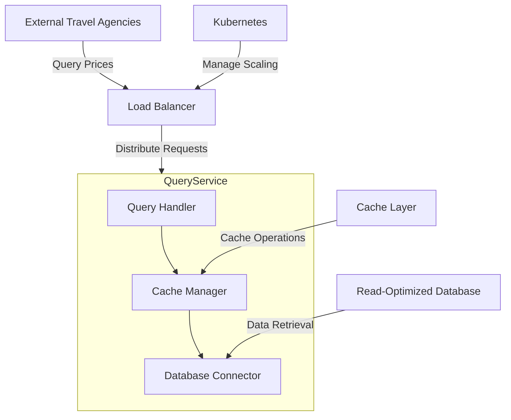

### Rationale

The instantiation of elements focuses on optimizing the query service for high performance. By implementing CQRS, caching, and a read-optimized database, the system can efficiently handle high volumes of concurrent queries. The use of Kubernetes for horizontal scaling ensures that the system can dynamically adjust to varying loads, maintaining performance under peak conditions.

---

**PAUSE for Review**: Please review the instantiated elements, defined interfaces, and architectural view before proceeding to the next steps.

---

# Iteration 1 | Step 6

# Architecture Document

## ADD Iteration 1

### Step 6: Record Design Decisions in Tables

In this step, we document the design decisions made during the refinement of the Query Service to enhance performance. This includes the selection of design concepts, their implementation, and the rationale behind these choices.

#### Design Decision Table

| Decision ID | Decision Description | Rationale | Alternatives Considered | Impact |
|-------------|----------------------|-----------|-------------------------|--------|
| DD-1        | Implement CQRS for Query Service | Separates read and write operations to optimize performance for queries. | Monolithic architecture with combined read/write operations | Improved query performance and scalability |
| DD-2        | Use Caching Layer (Redis/Memcached) | Reduces database load and improves response times for frequent queries. | Direct database access without caching | Faster response times, reduced database load |
| DD-3        | Deploy Read-Optimized Database (MongoDB/Hazelcast) | Enhances data retrieval speed for queries. | Traditional RDBMS | Faster data access, optimized for read operations |
| DD-4        | Enable Horizontal Scaling with Kubernetes | Allows dynamic scaling of query service instances to handle load. | Static server allocation | Improved scalability and resource utilization |

### Rationale

The design decisions focus on optimizing the Query Service to meet the performance quality attribute driver (QA-1). By implementing CQRS, caching, and a read-optimized database, the system can efficiently handle high volumes of concurrent queries. The use of Kubernetes for horizontal scaling ensures that the system can dynamically adjust to varying loads, maintaining performance under peak conditions.

- **CQRS**: By separating the command and query responsibilities, the system can optimize each side independently, leading to better performance and scalability.
- **Caching**: A caching layer significantly reduces the need to access the database for frequently requested data, improving response times.
- **Read-Optimized Database**: Using a database optimized for read operations ensures that data retrieval is fast and efficient.
- **Horizontal Scaling**: Kubernetes allows the system to scale out by adding more instances of the query service, ensuring that performance remains consistent even under high load.

---

**PAUSE for Review**: Please review the recorded design decisions and their rationale before proceeding to the next steps.

---

# Iteration 1 | Step 7

# Architecture Document

## ADD Iteration 1

### Step 7: Analyze the Design to Ensure Drivers are Satisfied

In this step, we analyze the design decisions made during the refinement of the Query Service to ensure that the performance quality attribute driver (QA-1) is satisfied.

#### Analysis of Design Decisions

1. **CQRS Implementation**:
   - **Analysis**: By separating the command and query responsibilities, the system can optimize the query service for read operations. This separation allows for independent scaling and optimization, ensuring that the query service can handle high volumes of requests efficiently.
   - **Outcome**: The CQRS pattern effectively supports the performance goal by allowing the query service to focus solely on read operations, reducing complexity and improving response times.

2. **Caching Layer**:
   - **Analysis**: Implementing a caching layer significantly reduces the need to access the database for frequently requested data. This reduces latency and improves response times for repeated queries.
   - **Outcome**: The caching strategy directly contributes to meeting the 200ms response time requirement by minimizing database access for common queries.

3. **Read-Optimized Database**:
   - **Analysis**: Utilizing a read-optimized database ensures that data retrieval operations are fast and efficient. This choice supports high-performance query handling by reducing the time required to access data.
   - **Outcome**: The use of a read-optimized database aligns with the performance driver by enhancing data access speed, contributing to the overall system performance.

4. **Horizontal Scaling with Kubernetes**:
   - **Analysis**: Kubernetes enables dynamic scaling of the query service, allowing the system to add or remove instances based on load. This ensures that the system can handle peak traffic loads without performance degradation.
   - **Outcome**: Horizontal scaling ensures that the system can maintain the required performance levels even during periods of high demand, supporting the scalability aspect of the performance driver.

### Conclusion

The design decisions made during this iteration effectively address the performance quality attribute driver (QA-1). By implementing CQRS, caching, a read-optimized database, and horizontal scaling, the system is well-equipped to handle high volumes of concurrent queries while maintaining a response time of 200ms or less. These design choices ensure that the system can deliver a seamless experience to users querying room prices, even under peak traffic conditions.

---

**PAUSE for Review**: Please review the analysis of design decisions to ensure that the performance quality attribute driver is satisfied before proceeding to the next iteration.

---

# Iteration 2 | Step 2

# Iteration 2 | Step 2

# Architecture Document

## ADD Iteration 2

### Step 2: Establish Iteration Goal by Selecting Drivers

**Iteration Goal**: Enhance system reliability, focusing on the Event Bus to ensure that price updates are processed and synchronized reliably across all views, aligning with the reliability quality attribute driver (QA-2).

**Selected Driver**: 
- **Reliability (QA-2)**: Price updates must be successfully processed and synchronized across all views without data loss.

**Rationale**: 
The Event Bus is a critical component for ensuring that all price updates are reliably communicated and synchronized across the system. By focusing on this element, we aim to enhance the system's ability to handle updates without data loss, ensuring consistency and reliability in pricing information across all views.

---

**PAUSE for Review**: Please review the established iteration goal and selected drivers before proceeding to the next steps.

---

# Iteration 2 | Step 3

# Iteration 2 | Step 3

# Architecture Document

## ADD Iteration 2

### Step 3: Choose Elements of the System to Refine

**Element to Refine**: Event Bus

**Rationale**: 
The Event Bus is a pivotal component for ensuring reliable communication and synchronization of price updates across the system. It plays a crucial role in maintaining data consistency and reliability, which are essential for meeting the reliability quality attribute driver (QA-2). By refining the Event Bus, we aim to enhance its ability to handle updates without data loss, ensuring that all views are consistently updated with the latest pricing information.

### Current State of the Event Bus

- **Functionality**: Facilitates the communication of price updates and other events across the system.
- **Reliability Requirement**: Must ensure that all price updates are processed and synchronized across all views without data loss.
- **Current Challenges**: Potential issues with message delivery reliability and event processing consistency.

### Refinement Focus

- **Reliable Messaging**: Implement mechanisms to ensure that messages are delivered reliably and processed in the correct order.
- **Event Sourcing**: Utilize event sourcing to maintain a complete history of changes, allowing for accurate reconstruction of state.
- **Fault Tolerance**: Enhance the Event Bus to handle failures gracefully, ensuring that no data is lost during outages or disruptions.

---

**PAUSE for Review**: Please review the chosen elements for refinement and the rationale before proceeding to the next steps.

---

# Iteration 2 | Step 4

# Architecture Document

## ADD Iteration 2

### Step 4: Choose Design Concepts (Patterns/Tactics)

**Design Concepts for Event Bus Refinement**:

1. **Reliable Messaging**:
   - **Rationale**: Implementing reliable messaging ensures that all messages (price updates) are delivered and processed without loss. This is crucial for maintaining data consistency and reliability across the system, aligning with the reliability quality attribute driver (QA-2).

2. **Event Sourcing**:
   - **Rationale**: By using event sourcing, the system can maintain a complete history of all changes, allowing for accurate reconstruction of state and ensuring that no updates are lost. This pattern supports the reliability goal by providing a robust mechanism for state recovery and auditing.

3. **Message Acknowledgment and Retry Mechanism**:
   - **Rationale**: Implementing acknowledgment and retry mechanisms ensures that messages are processed successfully. If a message fails to be processed, it can be retried until successful, reducing the risk of data loss.

4. **Fault Tolerance**:
   - **Rationale**: Enhance the Event Bus with fault tolerance capabilities to handle failures gracefully. This includes mechanisms for automatic failover and recovery, ensuring continuous operation even in the event of component failures.

### Design Concept Implementation

- **Reliable Messaging**: Use a message broker like Apache Kafka or RabbitMQ that supports reliable message delivery and processing guarantees.
- **Event Sourcing**: Implement an event store to persist all events, allowing the system to reconstruct state from the event history.
- **Message Acknowledgment and Retry**: Configure the message broker to require acknowledgments for message processing and implement retry logic for failed deliveries.
- **Fault Tolerance**: Deploy the Event Bus in a redundant configuration with automatic failover capabilities to ensure high availability.

### Architectural View

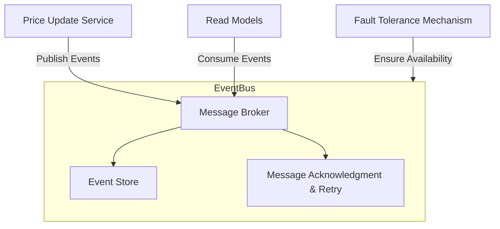

### Rationale

The design concepts focus on enhancing the reliability of the Event Bus to ensure that price updates are processed and synchronized across all views without data loss. By implementing reliable messaging, event sourcing, and fault tolerance, the system can maintain data consistency and reliability, even in the face of failures or disruptions. These design choices align with the reliability quality attribute driver (QA-2), ensuring that the system can handle updates reliably and maintain accurate pricing information across all views.

---

**PAUSE for Review**: Please review the chosen design concepts and their rationale before proceeding to the next steps.

---

# Iteration 2 | Step 5

# Architecture Document

## ADD Iteration 2

### Step 5: Instantiate Elements, Define Interfaces, and Sketch Views

**Instantiation of Elements**:

1. **Event Bus**:
   - **Role**: Facilitates reliable communication and synchronization of price updates across the system.
   - **Components**:
     - **Message Broker**: Manages the publishing and consumption of messages (events).
     - **Event Store**: Persists all events for event sourcing and state reconstruction.
     - **Message Acknowledgment & Retry**: Ensures messages are processed successfully, with retry logic for failures.
     - **Fault Tolerance Mechanism**: Provides redundancy and failover capabilities to ensure high availability.

2. **Message Broker**:
   - **Role**: Handles the reliable delivery of messages.
   - **Technology**: Apache Kafka or RabbitMQ.
   - **Interface**: Provides methods for publishing and consuming messages with acknowledgment.

3. **Event Store**:
   - **Role**: Stores a complete history of events for event sourcing.
   - **Technology**: Event store database or a distributed log system.
   - **Interface**: Allows for appending new events and querying historical events.

4. **Fault Tolerance Mechanism**:
   - **Role**: Ensures continuous operation and availability of the Event Bus.
   - **Technology**: Clustered deployment with automatic failover.
   - **Interface**: Monitors system health and manages failover processes.

**Interfaces**:

- **Message Broker Interface**:
  - `publishEvent(event)`: Publishes a new event to the message broker.
  - `consumeEvent()`: Consumes events from the broker with acknowledgment.

- **Event Store Interface**:
  - `appendEvent(event)`: Appends a new event to the event store.
  - `queryEvents(criteria)`: Retrieves events based on specified criteria.

- **Fault Tolerance Interface**:
  - `monitorHealth()`: Monitors the health of the Event Bus components.
  - `triggerFailover()`: Initiates failover procedures in case of component failure.

**Architectural View**:

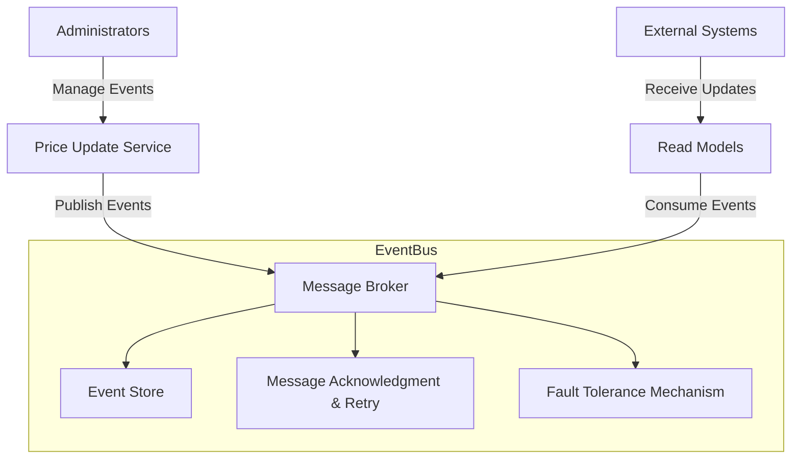

### Rationale

The instantiation of elements focuses on enhancing the reliability of the Event Bus to ensure that price updates are processed and synchronized across all views without data loss. By implementing reliable messaging, event sourcing, and fault tolerance, the system can maintain data consistency and reliability, even in the face of failures or disruptions. These design choices align with the reliability quality attribute driver (QA-2), ensuring that the system can handle updates reliably and maintain accurate pricing information across all views.

---

**PAUSE for Review**: Please review the instantiated elements, defined interfaces, and architectural view before proceeding to the next steps.

---

# Iteration 2 | Step 6

# Architecture Document

## ADD Iteration 2

### Step 6: Record Design Decisions in Tables

In this step, we document the design decisions made during the refinement of the Event Bus to enhance reliability. This includes the selection of design concepts, their implementation, and the rationale behind these choices.

#### Design Decision Table

| Decision ID | Decision Description | Rationale | Alternatives Considered | Impact |
|-------------|----------------------|-----------|-------------------------|--------|
| DD-5        | Implement Reliable Messaging with Apache Kafka/RabbitMQ | Ensures all messages are delivered and processed without loss, maintaining data consistency. | Simple message queue without delivery guarantees | Enhanced reliability and data consistency |
| DD-6        | Use Event Sourcing for State Reconstruction | Maintains a complete history of changes, allowing accurate state reconstruction and auditing. | Traditional state storage without event history | Improved reliability and auditability |
| DD-7        | Implement Message Acknowledgment and Retry Mechanism | Ensures messages are processed successfully, with retries for failures, reducing data loss risk. | No retry mechanism, leading to potential data loss | Increased reliability and message processing success |
| DD-8        | Deploy Fault Tolerance Mechanism with Automatic Failover | Ensures continuous operation and availability of the Event Bus, even during failures. | Single point of failure without redundancy | Improved system availability and fault tolerance |

### Rationale

The design decisions focus on enhancing the reliability of the Event Bus to ensure that price updates are processed and synchronized across all views without data loss. By implementing reliable messaging, event sourcing, and fault tolerance, the system can maintain data consistency and reliability, even in the face of failures or disruptions. These design choices align with the reliability quality attribute driver (QA-2), ensuring that the system can handle updates reliably and maintain accurate pricing information across all views.

- **Reliable Messaging**: Using a message broker like Apache Kafka or RabbitMQ ensures that messages are delivered reliably, reducing the risk of data loss.
- **Event Sourcing**: Maintaining a complete history of events allows for accurate state reconstruction and auditing, enhancing reliability.
- **Message Acknowledgment and Retry**: Implementing acknowledgment and retry mechanisms ensures that messages are processed successfully, even in the event of failures.
- **Fault Tolerance**: Deploying the Event Bus with fault tolerance capabilities ensures continuous operation and availability, even during component failures.

---

**PAUSE for Review**: Please review the recorded design decisions and their rationale before proceeding to the next steps.

---

# Iteration 2 | Step 7

# Architecture Document

## ADD Iteration 2

### Step 7: Analyze the Design to Ensure Drivers are Satisfied

In this step, we analyze the design decisions made during the refinement of the Event Bus to ensure that the reliability quality attribute driver (QA-2) is satisfied.

#### Analysis of Design Decisions

1. **Reliable Messaging with Apache Kafka/RabbitMQ**:
   - **Analysis**: The use of a robust message broker like Apache Kafka or RabbitMQ ensures that all messages are delivered reliably and processed without loss. This choice supports the system's need for consistent and reliable communication of price updates.
   - **Outcome**: Reliable messaging directly contributes to the reliability goal by ensuring that all price updates are communicated and processed without data loss, maintaining data consistency across all views.

2. **Event Sourcing for State Reconstruction**:
   - **Analysis**: Implementing event sourcing allows the system to maintain a complete history of all changes, enabling accurate reconstruction of state and providing a robust mechanism for auditing and recovery.
   - **Outcome**: Event sourcing enhances reliability by ensuring that all changes are recorded and can be replayed to reconstruct the system state, reducing the risk of data loss.

3. **Message Acknowledgment and Retry Mechanism**:
   - **Analysis**: The acknowledgment and retry mechanisms ensure that messages are processed successfully, even in the event of failures. This reduces the risk of data loss and ensures that all updates are eventually processed.
   - **Outcome**: These mechanisms increase the reliability of message processing, ensuring that all updates are successfully communicated and synchronized across the system.

4. **Fault Tolerance with Automatic Failover**:
   - **Analysis**: Deploying the Event Bus with fault tolerance capabilities, including automatic failover, ensures continuous operation and availability, even during component failures.
   - **Outcome**: Fault tolerance ensures that the system remains operational and available, even in the face of failures, supporting the reliability driver by maintaining consistent and reliable communication of updates.

### Conclusion

The design decisions made during this iteration effectively address the reliability quality attribute driver (QA-2). By implementing reliable messaging, event sourcing, message acknowledgment and retry mechanisms, and fault tolerance, the system is well-equipped to handle price updates reliably and maintain data consistency across all views. These design choices ensure that the system can process and synchronize updates without data loss, providing a reliable and consistent experience for users and external systems interacting with the Hotel Pricing System.

---

**PAUSE for Review**: Please review the analysis of design decisions to ensure that the reliability quality attribute driver is satisfied before proceeding to the next iteration.

---

# Iteration 3 | Step 2

# Iteration 3 | Step 2

# Architecture Document

## ADD Iteration 3

### Step 2: Establish Iteration Goal by Selecting Drivers

**Iteration Goal**: Enhance system scalability, focusing on the Read Model to enable independent scaling of the read side, aligning with the scalability quality attribute driver (QA-4).

**Selected Driver**: 
- **Scalability (QA-4)**: The query (read) side of the system must be able to scale independently to handle massive bursts of travel agency traffic.

**Rationale**: 
The Read Model is a critical component for handling query operations, especially during peak traffic loads from external travel agencies. By focusing on this element, we aim to enhance the system's ability to scale independently, ensuring that it can handle massive bursts of traffic without performance degradation. This aligns with the scalability quality attribute driver (QA-4), ensuring that the system can maintain performance and responsiveness under varying load conditions.

---

**PAUSE for Review**: Please review the established iteration goal and selected drivers before proceeding to the next steps.

---

# Iteration 3 | Step 3

# Iteration 3 | Step 3

# Architecture Document

## ADD Iteration 3

### Step 3: Choose Elements of the System to Refine

**Element to Refine**: Read Model

**Rationale**: 
The Read Model is a crucial component for handling query operations, especially during peak traffic loads from external travel agencies. Given the scalability goal of enabling the query side to scale independently, refining this element is essential to ensure it can efficiently handle massive bursts of traffic without performance degradation. This aligns with the scalability quality attribute driver (QA-4), ensuring that the system can maintain performance and responsiveness under varying load conditions.

### Current State of the Read Model

- **Functionality**: Provides optimized data views for fast query responses.
- **Scalability Requirement**: Must be able to scale independently to handle massive bursts of travel agency traffic.
- **Current Challenges**: Potential bottlenecks in handling high volumes of concurrent queries and scaling efficiently.

### Refinement Focus

- **Horizontal Scaling**: Design the Read Model to support horizontal scaling, allowing additional instances to be added to handle increased query loads.
- **Load Balancing**: Implement load balancing to distribute incoming query requests evenly across multiple instances of the Read Model.
- **Data Partitioning**: Utilize data partitioning strategies to distribute data across multiple nodes, improving query performance and scalability.
- **Cloud-Native Deployment**: Leverage cloud-native services and infrastructure to facilitate easy scaling and management of the Read Model.

---

**PAUSE for Review**: Please review the chosen elements for refinement and the rationale before proceeding to the next steps.

---

# Iteration 3 | Step 4

# Architecture Document

## ADD Iteration 3

### Step 4: Choose Design Concepts (Patterns/Tactics)

**Design Concepts for Read Model Refinement**:

1. **Horizontal Scaling**:
   - **Rationale**: By designing the Read Model to support horizontal scaling, the system can add more instances to handle increased query loads. This ensures that the query side can scale independently, aligning with the scalability quality attribute driver (QA-4).

2. **Load Balancing**:
   - **Rationale**: Implementing load balancing ensures that incoming query requests are distributed evenly across multiple instances of the Read Model. This prevents any single instance from becoming a bottleneck, improving overall system performance and scalability.

3. **Data Partitioning**:
   - **Rationale**: Utilizing data partitioning strategies allows the system to distribute data across multiple nodes. This improves query performance by enabling parallel processing and reducing the load on individual nodes.

4. **Cloud-Native Deployment**:
   - **Rationale**: Leveraging cloud-native services and infrastructure facilitates easy scaling and management of the Read Model. This aligns with the constraint to use managed services on a public cloud provider (CON-6).

### Design Concept Implementation

- **Horizontal Scaling**: Deploy the Read Model in a containerized environment using Kubernetes, allowing for the dynamic addition of instances based on load.
- **Load Balancing**: Use a cloud-native load balancer, such as AWS Elastic Load Balancing or Google Cloud Load Balancing, to distribute incoming requests across Read Model instances.
- **Data Partitioning**: Implement sharding or partitioning strategies using a distributed database like Amazon DynamoDB or Google Cloud Spanner to distribute data across multiple nodes.
- **Cloud-Native Deployment**: Utilize managed services for deployment, such as AWS Fargate or Google Kubernetes Engine, to simplify scaling and management.

### Architectural View

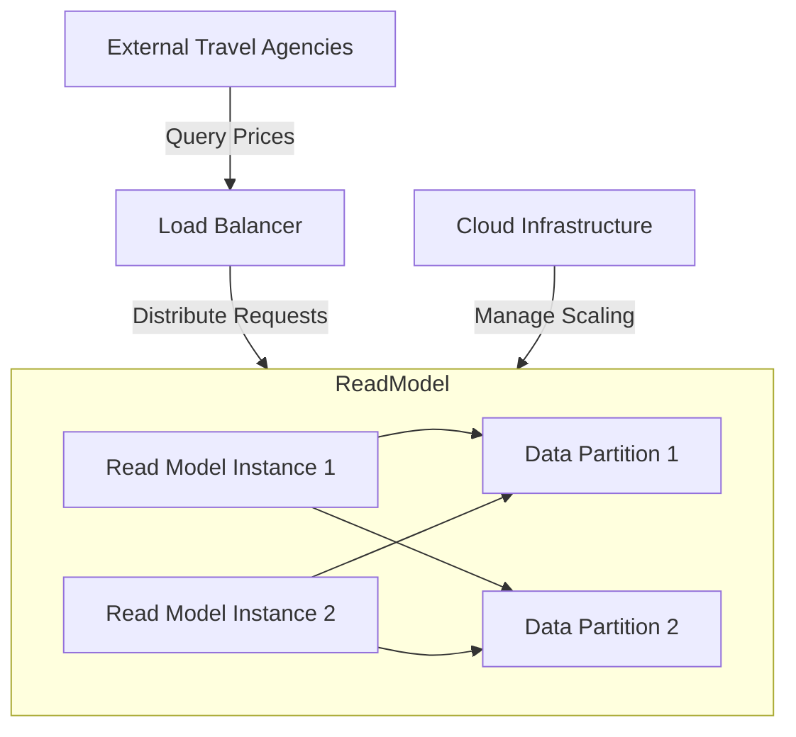

### Rationale

The design concepts focus on enhancing the scalability of the Read Model to ensure that the query side can scale independently and handle massive bursts of traffic without performance degradation. By implementing horizontal scaling, load balancing, data partitioning, and cloud-native deployment, the system can efficiently manage high volumes of concurrent queries. These design choices align with the scalability quality attribute driver (QA-4) and the cloud-native constraint (CON-6), ensuring that the system can maintain performance and responsiveness under varying load conditions.

---

**PAUSE for Review**: Please review the chosen design concepts and their rationale before proceeding to the next steps.

---

# Iteration 3 | Step 5

# Architecture Document

## ADD Iteration 3

### Step 5: Instantiate Elements, Define Interfaces, and Sketch Views

**Instantiation of Elements**:

1. **Read Model**:
   - **Role**: Provides optimized data views for fast query responses and handles high volumes of concurrent queries.
   - **Components**:
     - **Read Model Instances**: Multiple instances to handle query requests, supporting horizontal scaling.
     - **Data Partitions**: Distributed data storage to improve query performance and scalability.
     - **Load Balancer**: Distributes incoming query requests evenly across Read Model instances.
     - **Cloud Infrastructure**: Manages scaling and deployment of Read Model instances.

2. **Read Model Instances**:
   - **Role**: Handle incoming query requests and provide fast responses.
   - **Technology**: Containerized applications running on Kubernetes.
   - **Interface**: Exposes query endpoints for retrieving pricing information.

3. **Data Partitions**:
   - **Role**: Distribute data across multiple nodes to improve performance and scalability.
   - **Technology**: Distributed database like Amazon DynamoDB or Google Cloud Spanner.
   - **Interface**: Provides data access methods for querying partitioned data.

4. **Load Balancer**:
   - **Role**: Distributes incoming requests across multiple Read Model instances.
   - **Technology**: AWS Elastic Load Balancing or Google Cloud Load Balancing.
   - **Interface**: Manages request distribution and monitors instance health.

5. **Cloud Infrastructure**:
   - **Role**: Manages the deployment, scaling, and operation of Read Model instances.
   - **Technology**: AWS Fargate, Google Kubernetes Engine, or similar managed services.
   - **Interface**: Provides scaling and management capabilities for cloud-native deployments.

**Interfaces**:

- **Read Model Interface**:
  - `getPrice(hotelId, roomType, date)`: Retrieves the current price for a specified hotel, room type, and date.
  - `getPartitionedData(query)`: Accesses data from specific partitions to fulfill query requests.

- **Load Balancer Interface**:
  - `distributeRequest(request)`: Distributes incoming query requests to available Read Model instances.
  - `monitorHealth()`: Monitors the health of Read Model instances and adjusts distribution accordingly.

- **Cloud Infrastructure Interface**:
  - `scaleInstances(count)`: Adjusts the number of Read Model instances based on load.
  - `deployInstance(instanceConfig)`: Deploys new instances of the Read Model as needed.

**Architectural View**:

### Rationale

The instantiation of elements focuses on enhancing the scalability of the Read Model to ensure that the query side can scale independently and handle massive bursts of traffic without performance degradation. By implementing horizontal scaling, load balancing, data partitioning, and cloud-native deployment, the system can efficiently manage high volumes of concurrent queries. These design choices align with the scalability quality attribute driver (QA-4) and the cloud-native constraint (CON-6), ensuring that the system can maintain performance and responsiveness under varying load conditions.

---

**PAUSE for Review**: Please review the instantiated elements, defined interfaces, and architectural view before proceeding to the next steps.

---

# Iteration 3 | Step 6

# Architecture Document

## ADD Iteration 3

### Step 6: Record Design Decisions in Tables

In this step, we document the design decisions made during the refinement of the Read Model to enhance scalability. This includes the selection of design concepts, their implementation, and the rationale behind these choices.

#### Design Decision Table

| Decision ID | Decision Description | Rationale | Alternatives Considered | Impact |
|-------------|----------------------|-----------|-------------------------|--------|
| DD-9        | Implement Horizontal Scaling for Read Model | Allows the query side to scale independently, handling increased loads efficiently. | Vertical scaling with larger instances | Improved scalability and resource utilization |
| DD-10       | Use Load Balancing for Request Distribution | Ensures even distribution of query requests across Read Model instances, preventing bottlenecks. | Round-robin DNS without health checks | Enhanced performance and reliability |
| DD-11       | Implement Data Partitioning with Distributed Database | Distributes data across nodes, improving query performance and scalability. | Single-node database with no partitioning | Improved query performance and fault tolerance |
| DD-12       | Deploy Read Model on Cloud-Native Infrastructure | Facilitates easy scaling and management, aligning with cloud-native constraints. | On-premises deployment with manual scaling | Enhanced scalability, management, and cost efficiency |

### Rationale

The design decisions focus on enhancing the scalability of the Read Model to ensure that the query side can scale independently and handle massive bursts of traffic without performance degradation. By implementing horizontal scaling, load balancing, data partitioning, and cloud-native deployment, the system can efficiently manage high volumes of concurrent queries. These design choices align with the scalability quality attribute driver (QA-4) and the cloud-native constraint (CON-6), ensuring that the system can maintain performance and responsiveness under varying load conditions.

- **Horizontal Scaling**: By allowing the Read Model to scale horizontally, the system can add more instances to handle increased query loads, ensuring that performance remains consistent even during peak traffic.
- **Load Balancing**: Implementing load balancing ensures that incoming requests are distributed evenly across Read Model instances, preventing any single instance from becoming a bottleneck and improving overall system performance.
- **Data Partitioning**: Utilizing data partitioning strategies allows the system to distribute data across multiple nodes, improving query performance by enabling parallel processing and reducing the load on individual nodes.
- **Cloud-Native Deployment**: Leveraging cloud-native services and infrastructure facilitates easy scaling and management of the Read Model, aligning with the constraint to use managed services on a public cloud provider (CON-6).

---

**PAUSE for Review**: Please review the recorded design decisions and their rationale before proceeding to the next steps.

---

# Iteration 3 | Step 7

# Architecture Document

## ADD Iteration 3

### Step 7: Analyze the Design to Ensure Drivers are Satisfied

In this step, we analyze the design decisions made during the refinement of the Read Model to ensure that the scalability quality attribute driver (QA-4) is satisfied.

#### Analysis of Design Decisions

1. **Horizontal Scaling for Read Model**:
   - **Analysis**: By enabling horizontal scaling, the Read Model can dynamically add more instances to handle increased query loads. This ensures that the query side can scale independently, maintaining performance and responsiveness even during peak traffic.
   - **Outcome**: Horizontal scaling directly supports the scalability goal by allowing the system to efficiently manage high volumes of concurrent queries without performance degradation.

2. **Load Balancing for Request Distribution**:
   - **Analysis**: Implementing load balancing ensures that incoming query requests are evenly distributed across multiple Read Model instances. This prevents any single instance from becoming a bottleneck, improving overall system performance and reliability.
   - **Outcome**: Load balancing enhances scalability by ensuring that the system can handle massive bursts of traffic without overloading individual instances, maintaining consistent performance.

3. **Data Partitioning with Distributed Database**:
   - **Analysis**: Utilizing data partitioning strategies allows the system to distribute data across multiple nodes, improving query performance by enabling parallel processing and reducing the load on individual nodes.
   - **Outcome**: Data partitioning improves scalability by allowing the system to handle large datasets efficiently, supporting high-performance query operations.

4. **Cloud-Native Deployment**:
   - **Analysis**: Leveraging cloud-native services and infrastructure facilitates easy scaling and management of the Read Model. This aligns with the constraint to use managed services on a public cloud provider (CON-6).
   - **Outcome**: Cloud-native deployment enhances scalability by providing flexible and cost-effective scaling options, ensuring that the system can adapt to varying load conditions.

### Conclusion

The design decisions made during this iteration effectively address the scalability quality attribute driver (QA-4). By implementing horizontal scaling, load balancing, data partitioning, and cloud-native deployment, the system is well-equipped to handle massive bursts of traffic without performance degradation. These design choices ensure that the query side can scale independently, maintaining performance and responsiveness under varying load conditions. Additionally, the use of cloud-native services aligns with the constraint to use managed services on a public cloud provider (CON-6), providing a robust and scalable solution for the Hotel Pricing System.

---

**PAUSE for Review**: Please review the analysis of design decisions to ensure that the scalability quality attribute driver is satisfied before proceeding to the next iteration.

---

# Iteration 4 | Step 2

# Iteration 4 | Step 2

# Architecture Document

## ADD Iteration 4

### Step 2: Establish Iteration Goal by Selecting Drivers

**Iteration Goal**: Leverage cloud-native patterns and services to enhance the deployment architecture, aligning with the cloud-native constraint (CON-6).

**Selected Driver**: 
- **Cloud-Native (CON-6)**: The system must be designed to run on a public cloud provider using managed services.

**Rationale**: 
The deployment architecture is a critical aspect of ensuring that the system can fully leverage the benefits of cloud-native patterns and services. By focusing on this element, we aim to enhance the system's ability to utilize managed services on a public cloud provider, ensuring scalability, reliability, and cost-effectiveness. This aligns with the cloud-native constraint (CON-6), ensuring that the system is designed to operate efficiently in a cloud environment.

---

**PAUSE for Review**: Please review the established iteration goal and selected drivers before proceeding to the next steps.

---

# Iteration 4 | Step 3

# Iteration 4 | Step 3

# Architecture Document

## ADD Iteration 4

### Step 3: Choose Elements of the System to Refine

**Element to Refine**: Deployment Architecture

**Rationale**: 
The deployment architecture is a critical component for ensuring that the system can fully leverage cloud-native patterns and services. By refining this element, we aim to enhance the system's ability to utilize managed services on a public cloud provider, ensuring scalability, reliability, and cost-effectiveness. This aligns with the cloud-native constraint (CON-6), ensuring that the system is designed to operate efficiently in a cloud environment.

### Current State of the Deployment Architecture

- **Functionality**: Supports the deployment and operation of the Hotel Pricing System on a cloud platform.
- **Cloud-Native Requirement**: Must be designed to run on a public cloud provider using managed services.
- **Current Challenges**: Potential inefficiencies in resource utilization and management, lack of integration with cloud-native services.

### Refinement Focus

- **Microservices Architecture**: Adopt a microservices architecture to enable independent deployment and scaling of system components.
- **Managed Services**: Utilize managed cloud services for databases, messaging, and compute resources to reduce operational overhead.
- **Containerization**: Implement containerization for all services to ensure consistent deployment and scaling across environments.
- **Service Mesh**: Integrate a service mesh to manage service-to-service communication, security, and observability.

---

**PAUSE for Review**: Please review the chosen elements for refinement and the rationale before proceeding to the next steps.

---

# Iteration 4 | Step 4

# Architecture Document

## ADD Iteration 4

### Step 4: Choose Design Concepts (Patterns/Tactics)

**Design Concepts for Deployment Architecture Refinement**:

1. **Microservices Architecture**:
   - **Rationale**: Adopting a microservices architecture allows for independent deployment and scaling of system components. This enhances flexibility, scalability, and maintainability, aligning with the cloud-native constraint (CON-6) and the modular structure concern (CRN-1).

2. **Managed Services**:
   - **Rationale**: Utilizing managed cloud services for databases, messaging, and compute resources reduces operational overhead and ensures high availability and scalability. This aligns with the cloud-native constraint (CON-6) by leveraging the capabilities of public cloud providers.

3. **Containerization**:
   - **Rationale**: Implementing containerization for all services ensures consistent deployment and scaling across environments. This facilitates the use of cloud-native orchestration tools like Kubernetes, enhancing scalability and resource management.

4. **Service Mesh**:
   - **Rationale**: Integrating a service mesh provides a dedicated infrastructure layer for managing service-to-service communication, security, and observability. This enhances the reliability and security of the system, supporting the reliability quality attribute driver (QA-2).

### Design Concept Implementation

- **Microservices Architecture**: Decompose the system into independent services, each responsible for a specific business capability, such as pricing, hotel management, and query handling.
- **Managed Services**: Use cloud provider-managed services such as AWS RDS for databases, AWS SQS for messaging, and AWS Lambda for serverless compute functions.
- **Containerization**: Deploy all services in Docker containers, orchestrated by Kubernetes, to ensure consistent and scalable deployments.
- **Service Mesh**: Implement a service mesh like Istio to manage service communication, providing features like traffic management, security, and observability.

### Architectural View

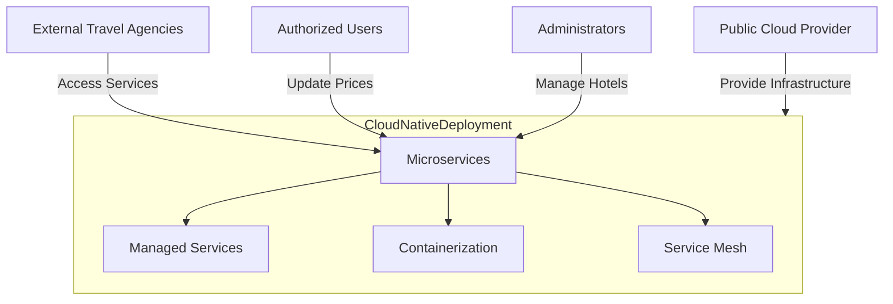

### Rationale

The design concepts focus on leveraging cloud-native patterns and services to enhance the deployment architecture. By adopting a microservices architecture, utilizing managed services, implementing containerization, and integrating a service mesh, the system can fully leverage the benefits of cloud-native environments. These design choices align with the cloud-native constraint (CON-6) and the modular structure concern (CRN-1), ensuring that the system is designed to operate efficiently in a cloud environment. This approach enhances scalability, reliability, and cost-effectiveness, providing a robust foundation for the Hotel Pricing System.

---

**PAUSE for Review**: Please review the chosen design concepts and their rationale before proceeding to the next steps.

---

# Iteration 4 | Step 5

# Architecture Document

## ADD Iteration 4

### Step 5: Instantiate Elements, Define Interfaces, and Sketch Views

**Instantiation of Elements**:

1. **Microservices**:
   - **Role**: Decompose the system into independent services, each responsible for a specific business capability.
   - **Components**:
     - **Pricing Service**: Manages price updates and calculations.
     - **Hotel Management Service**: Handles hotel profile creation and updates.
     - **Query Service**: Provides pricing information to external systems.
   - **Technology**: Each service is deployed as a containerized application.

2. **Managed Services**:
   - **Role**: Utilize cloud provider-managed services to reduce operational overhead.
   - **Components**:
     - **Database**: AWS RDS or Google Cloud SQL for relational data.
     - **Messaging**: AWS SQS or Google Pub/Sub for reliable messaging.
     - **Compute**: AWS Lambda or Google Cloud Functions for serverless operations.

3. **Containerization**:
   - **Role**: Ensure consistent deployment and scaling across environments.
   - **Technology**: Docker containers orchestrated by Kubernetes.
   - **Interface**: Provides deployment and scaling capabilities for all services.

4. **Service Mesh**:
   - **Role**: Manage service-to-service communication, security, and observability.
   - **Technology**: Istio or Linkerd.
   - **Interface**: Provides traffic management, security policies, and observability features.

**Interfaces**:

- **Pricing Service Interface**:
  - `updatePrice(hotelId, roomType, date, price)`: Updates the price for a specified hotel, room type, and date.
  - `calculatePrice(hotelId, roomType, date)`: Calculates the price based on current data.

- **Hotel Management Service Interface**:
  - `createHotelProfile(hotelData)`: Creates a new hotel profile.
  - `updateHotelProfile(hotelId, hotelData)`: Updates an existing hotel profile.

- **Query Service Interface**:
  - `getPrice(hotelId, roomType, date)`: Retrieves the current price for a specified hotel, room type, and date.

- **Service Mesh Interface**:
  - `manageTraffic(routeConfig)`: Manages traffic routing between services.
  - `applySecurityPolicy(policyConfig)`: Applies security policies for service communication.
  - `monitorService(serviceId)`: Provides observability and monitoring for services.

**Architectural View**:

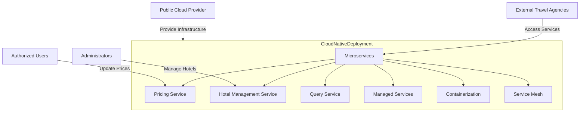

### Rationale

The instantiation of elements focuses on leveraging cloud-native patterns and services to enhance the deployment architecture. By adopting a microservices architecture, utilizing managed services, implementing containerization, and integrating a service mesh, the system can fully leverage the benefits of cloud-native environments. These design choices align with the cloud-native constraint (CON-6) and the modular structure concern (CRN-1), ensuring that the system is designed to operate efficiently in a cloud environment. This approach enhances scalability, reliability, and cost-effectiveness, providing a robust foundation for the Hotel Pricing System.

---

**PAUSE for Review**: Please review the instantiated elements, defined interfaces, and architectural view before proceeding to the next steps.

---

# Iteration 4 | Step 6

# Architecture Document

## ADD Iteration 4

### Step 6: Record Design Decisions in Tables

In this step, we document the design decisions made during the refinement of the Deployment Architecture to enhance cloud-native capabilities. This includes the selection of design concepts, their implementation, and the rationale behind these choices.

#### Design Decision Table

| Decision ID | Decision Description | Rationale | Alternatives Considered | Impact |
|-------------|----------------------|-----------|-------------------------|--------|
| DD-13       | Adopt Microservices Architecture | Enables independent deployment and scaling of system components, enhancing flexibility and maintainability. | Monolithic architecture with tightly coupled components | Improved scalability, flexibility, and maintainability |
| DD-14       | Utilize Managed Services for Databases, Messaging, and Compute | Reduces operational overhead and ensures high availability and scalability by leveraging cloud provider capabilities. | Self-managed infrastructure with higher operational burden | Enhanced reliability, scalability, and cost efficiency |
| DD-15       | Implement Containerization with Kubernetes | Ensures consistent deployment and scaling across environments, facilitating the use of cloud-native orchestration tools. | Traditional VM-based deployment with manual scaling | Improved scalability, resource management, and deployment consistency |
| DD-16       | Integrate Service Mesh for Service Communication | Provides a dedicated infrastructure layer for managing service-to-service communication, security, and observability. | Direct service communication without dedicated management layer | Enhanced reliability, security, and observability |

### Rationale

The design decisions focus on leveraging cloud-native patterns and services to enhance the deployment architecture. By adopting a microservices architecture, utilizing managed services, implementing containerization, and integrating a service mesh, the system can fully leverage the benefits of cloud-native environments. These design choices align with the cloud-native constraint (CON-6) and the modular structure concern (CRN-1), ensuring that the system is designed to operate efficiently in a cloud environment.

- **Microservices Architecture**: Decomposing the system into independent services allows for greater flexibility, scalability, and maintainability. Each service can be developed, deployed, and scaled independently, reducing complexity and improving resource utilization.
- **Managed Services**: Leveraging managed cloud services reduces operational overhead and ensures high availability and scalability. This approach allows the system to benefit from the capabilities of public cloud providers, such as automated scaling, backup, and recovery.
- **Containerization**: Implementing containerization ensures consistent deployment and scaling across environments. By using Kubernetes for orchestration, the system can efficiently manage resources and scale services based on demand.
- **Service Mesh**: Integrating a service mesh provides a dedicated infrastructure layer for managing service-to-service communication, security, and observability. This enhances the reliability and security of the system, supporting the reliability quality attribute driver (QA-2).

---

**PAUSE for Review**: Please review the recorded design decisions and their rationale to ensure alignment with the cloud-native constraint (CON-6) and the modular structure concern (CRN-1) before proceeding to the next steps.

---

# Iteration 4 | Step 7

# Architecture Document

## ADD Iteration 4

### Step 7: Analyze the Design to Ensure Drivers are Satisfied

In this step, we analyze the design decisions made during the refinement of the Deployment Architecture to ensure that the cloud-native constraint (CON-6) and the modular structure concern (CRN-1) are satisfied.

#### Analysis of Design Decisions

1. **Adopt Microservices Architecture**:
   - **Analysis**: By decomposing the system into independent microservices, each responsible for a specific business capability, the architecture supports independent deployment and scaling. This enhances flexibility, scalability, and maintainability, aligning with the modular structure concern (CRN-1).
   - **Outcome**: The microservices architecture supports the modular structure concern by allowing each service to evolve independently, facilitating long-term deployment and growth.

2. **Utilize Managed Services for Databases, Messaging, and Compute**:
   - **Analysis**: Leveraging managed cloud services reduces operational overhead and ensures high availability and scalability. This aligns with the cloud-native constraint (CON-6) by utilizing the capabilities of public cloud providers.
   - **Outcome**: Managed services enhance reliability and scalability, ensuring that the system can efficiently operate in a cloud environment, meeting the cloud-native constraint.

3. **Implement Containerization with Kubernetes**:
   - **Analysis**: Containerization ensures consistent deployment and scaling across environments. Using Kubernetes for orchestration facilitates resource management and scaling, aligning with cloud-native practices.
   - **Outcome**: Containerization supports the cloud-native constraint by enabling efficient resource utilization and scaling, ensuring that the system can adapt to varying load conditions.

4. **Integrate Service Mesh for Service Communication**:
   - **Analysis**: A service mesh provides a dedicated infrastructure layer for managing service-to-service communication, security, and observability. This enhances the reliability and security of the system, supporting the reliability quality attribute driver (QA-2).
   - **Outcome**: The service mesh enhances the system's reliability and security, ensuring that service communication is managed effectively, supporting both the reliability driver and the cloud-native constraint.

### Conclusion

The design decisions made during this iteration effectively address the cloud-native constraint (CON-6) and the modular structure concern (CRN-1). By adopting a microservices architecture, utilizing managed services, implementing containerization, and integrating a service mesh, the system is well-equipped to operate efficiently in a cloud environment. These design choices ensure that the system can leverage the benefits of cloud-native patterns and services, providing a robust and scalable foundation for the Hotel Pricing System. Additionally, the modular structure supports long-term deployment, maintainability, and growth, aligning with the overall architectural goals.

---

**PAUSE for Review**: Please review the analysis of design decisions to ensure that the cloud-native constraint (CON-6) and the modular structure concern (CRN-1) are satisfied before proceeding to the next iteration.

---

# Iteration 5 | Step 2

# Iteration 5 | Step 2

# Architecture Document

## ADD Iteration 5

### Step 2: Establish Iteration Goal by Selecting Drivers

**Iteration Goal**: Establish clear modular boundaries and interfaces for the service interfaces, aligning with the modular structure concern (CRN-1).

**Selected Driver**: 
- **Modular Structure (CRN-1)**: The architecture must establish a clear, modular structure that supports long-term deployment, maintainability, and growth.

**Rationale**: 
The service interfaces are critical for defining the boundaries and interactions between different components of the system. By focusing on this element, we aim to establish clear modular boundaries and interfaces, ensuring that the system is designed for long-term deployment, maintainability, and growth. This aligns with the modular structure concern (CRN-1), ensuring that the architecture supports the system's evolution and scalability over time.

---

**PAUSE for Review**: Please review the established iteration goal and selected drivers before proceeding to the next steps.

---

# Iteration 5 | Step 3

# Iteration 5 | Step 3

# Architecture Document

## ADD Iteration 5

### Step 3: Choose Elements of the System to Refine

**Element to Refine**: Service Interfaces

**Rationale**: 
Service interfaces are crucial for defining the boundaries and interactions between different components of the system. By refining these interfaces, we aim to establish clear modular boundaries that support long-term deployment, maintainability, and growth. This aligns with the modular structure concern (CRN-1), ensuring that the architecture supports the system's evolution and scalability over time.

### Current State of the Service Interfaces

- **Functionality**: Define the interactions and data exchange between different services within the system.
- **Modular Structure Requirement**: Must establish clear, modular boundaries that support long-term deployment, maintainability, and growth.
- **Current Challenges**: Potential lack of clarity in service boundaries and interactions, leading to tightly coupled components and reduced flexibility.

### Refinement Focus

- **API Gateway**: Implement an API Gateway to centralize and manage external access to services, providing a unified entry point.
- **Service Mesh**: Utilize a service mesh to manage internal service-to-service communication, ensuring secure and reliable interactions.
- **Clear Interface Definitions**: Define clear and consistent interfaces for each service, specifying the operations and data formats supported.
- **Versioning Strategy**: Implement a versioning strategy for service interfaces to manage changes and ensure backward compatibility.

---

**PAUSE for Review**: Please review the chosen elements for refinement and the rationale before proceeding to the next steps.

---

# Iteration 5 | Step 4

# Architecture Document

## ADD Iteration 5

### Step 4: Choose Design Concepts (Patterns/Tactics)

**Design Concepts for Service Interfaces Refinement**:

1. **API Gateway**:
   - **Rationale**: Implementing an API Gateway centralizes and manages external access to services, providing a unified entry point. This simplifies client interactions and enhances security by enforcing authentication and authorization policies at a single point. It aligns with the modular structure concern (CRN-1) by clearly defining the boundary between external clients and internal services.

2. **Service Mesh**:
   - **Rationale**: Utilizing a service mesh provides a dedicated infrastructure layer for managing internal service-to-service communication. It ensures secure, reliable, and observable interactions between services, supporting the modular structure concern (CRN-1) by maintaining clear boundaries and interactions within the system.

3. **Clear Interface Definitions**:
   - **Rationale**: Defining clear and consistent interfaces for each service ensures that the operations and data formats are well-documented and understood. This reduces coupling between services and supports maintainability and scalability, aligning with the modular structure concern (CRN-1).

4. **Versioning Strategy**:
   - **Rationale**: Implementing a versioning strategy for service interfaces allows for controlled evolution of services, ensuring backward compatibility and minimizing disruption. This supports long-term deployment and growth, aligning with the modular structure concern (CRN-1).

### Design Concept Implementation

- **API Gateway**: Deploy an API Gateway such as AWS API Gateway or Kong to manage external access to services. It will handle routing, authentication, and rate limiting for incoming requests.
- **Service Mesh**: Implement a service mesh like Istio or Linkerd to manage internal service communication, providing features like traffic management, security, and observability.
- **Clear Interface Definitions**: Use OpenAPI specifications to define service interfaces, ensuring that all operations and data formats are clearly documented and consistent.
- **Versioning Strategy**: Adopt a versioning strategy for APIs, such as semantic versioning, to manage changes and ensure backward compatibility.

### Architectural View

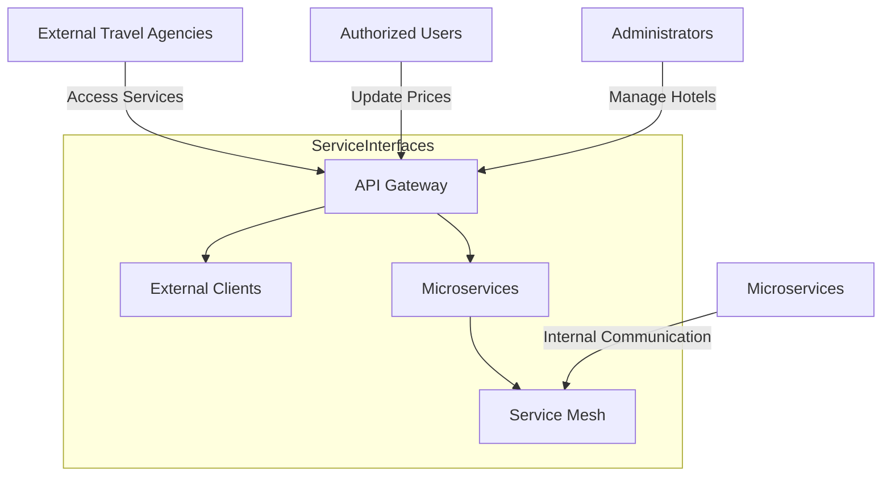

### Rationale

The design concepts focus on establishing clear modular boundaries and interfaces for the service interfaces, aligning with the modular structure concern (CRN-1). By implementing an API Gateway, utilizing a service mesh, defining clear interfaces, and adopting a versioning strategy, the system can maintain clear boundaries and interactions between components. These design choices ensure that the architecture supports long-term deployment, maintainability, and growth, providing a robust foundation for the Hotel Pricing System. The use of cloud-native tools and practices further enhances the system's ability to operate efficiently in a cloud environment, supporting the overall architectural goals.

---

**PAUSE for Review**: Please review the chosen design concepts and their rationale before proceeding to the next steps.

---

# Iteration 5 | Step 5

# Architecture Document

## ADD Iteration 5

### Step 5: Instantiate Elements, Define Interfaces, and Sketch Views

**Instantiation of Elements**:

1. **API Gateway**:
   - **Role**: Centralizes and manages external access to services, providing a unified entry point for clients.
   - **Components**:
     - **Routing**: Directs incoming requests to the appropriate service based on the request path and method.
     - **Authentication and Authorization**: Enforces security policies to ensure that only authorized users can access services.
     - **Rate Limiting**: Controls the rate of incoming requests to prevent abuse and ensure fair usage.
   - **Technology**: AWS API Gateway, Kong, or similar cloud-native API management solutions.

2. **Service Mesh**:
   - **Role**: Manages internal service-to-service communication, ensuring secure, reliable, and observable interactions.
   - **Components**:
     - **Traffic Management**: Controls the flow of traffic between services, including load balancing and routing.
     - **Security**: Provides mutual TLS authentication and authorization between services.
     - **Observability**: Offers monitoring and logging capabilities for service interactions.
   - **Technology**: Istio, Linkerd, or similar service mesh solutions.

3. **Service Interfaces**:
   - **Role**: Define the interactions and data exchange between different services within the system.
   - **Components**:
     - **OpenAPI Specifications**: Document the operations and data formats for each service interface.
     - **Versioning**: Implement a versioning strategy to manage changes and ensure backward compatibility.
   - **Technology**: OpenAPI, Swagger, or similar API documentation tools.

**Interfaces**:

- **API Gateway Interface**:
  - `routeRequest(request)`: Directs incoming requests to the appropriate service.
  - `authenticateUser(token)`: Validates user credentials and permissions.
  - `applyRateLimit(clientId)`: Enforces rate limiting policies for incoming requests.

- **Service Mesh Interface**:
  - `manageTraffic(routeConfig)`: Manages traffic routing between services.
  - `applySecurityPolicy(policyConfig)`: Applies security policies for service communication.
  - `monitorService(serviceId)`: Provides observability and monitoring for services.

- **Service Interface Definitions**:
  - **Pricing Service**:
    - `updatePrice(hotelId, roomType, date, price)`: Updates the price for a specified hotel, room type, and date.
    - `calculatePrice(hotelId, roomType, date)`: Calculates the price based on current data.
  - **Hotel Management Service**:
    - `createHotelProfile(hotelData)`: Creates a new hotel profile.
    - `updateHotelProfile(hotelId, hotelData)`: Updates an existing hotel profile.
  - **Query Service**:
    - `getPrice(hotelId, roomType, date)`: Retrieves the current price for a specified hotel, room type, and date.

**Architectural View**:

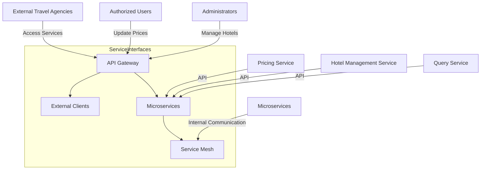

### Rationale

The instantiation of elements focuses on establishing clear modular boundaries and interfaces for the service interfaces, aligning with the modular structure concern (CRN-1). By implementing an API Gateway, utilizing a service mesh, defining clear interfaces, and adopting a versioning strategy, the system can maintain clear boundaries and interactions between components. These design choices ensure that the architecture supports long-term deployment, maintainability, and growth, providing a robust foundation for the Hotel Pricing System. The use of cloud-native tools and practices further enhances the system's ability to operate efficiently in a cloud environment, supporting the overall architectural goals.

---

**PAUSE for Review**: Please review the instantiated elements, defined interfaces, and architectural view before proceeding to the next steps.

---

# Iteration 5 | Step 6

# Architecture Document

## ADD Iteration 5

### Step 6: Record Design Decisions in Tables

In this step, we document the design decisions made during the refinement of the Service Interfaces to establish clear modular boundaries and interfaces. This includes the selection of design concepts, their implementation, and the rationale behind these choices.

#### Design Decision Table

| Decision ID | Decision Description | Rationale | Alternatives Considered | Impact |
|-------------|----------------------|-----------|-------------------------|--------|
| DD-17       | Implement API Gateway for Centralized Access | Centralizes and manages external access to services, providing a unified entry point and enhancing security. | Direct access to services without centralized management | Improved security, manageability, and client interaction |
| DD-18       | Utilize Service Mesh for Internal Communication | Provides a dedicated infrastructure layer for managing service-to-service communication, ensuring secure and reliable interactions. | Direct service communication without dedicated management layer | Enhanced reliability, security, and observability |
| DD-19       | Define Clear and Consistent Service Interfaces | Ensures that operations and data formats are well-documented and understood, reducing coupling and supporting maintainability. | Ad-hoc interface definitions without standardization | Improved maintainability, scalability, and modularity |
| DD-20       | Implement Versioning Strategy for Service Interfaces | Allows for controlled evolution of services, ensuring backward compatibility and minimizing disruption. | No versioning strategy, leading to potential compatibility issues | Enhanced flexibility, compatibility, and growth |

### Rationale

The design decisions focus on establishing clear modular boundaries and interfaces for the service interfaces, aligning with the modular structure concern (CRN-1). By implementing an API Gateway, utilizing a service mesh, defining clear interfaces, and adopting a versioning strategy, the system can maintain clear boundaries and interactions between components. These design choices ensure that the architecture supports long-term deployment, maintainability, and growth, providing a robust foundation for the Hotel Pricing System.

- **API Gateway**: Centralizing access through an API Gateway simplifies client interactions and enhances security by enforcing authentication and authorization policies at a single point. This aligns with the modular structure concern by clearly defining the boundary between external clients and internal services.
- **Service Mesh**: Utilizing a service mesh provides a dedicated infrastructure layer for managing internal service-to-service communication. It ensures secure, reliable, and observable interactions between services, supporting the modular structure concern by maintaining clear boundaries and interactions within the system.
- **Clear Interface Definitions**: Defining clear and consistent interfaces for each service ensures that the operations and data formats are well-documented and understood. This reduces coupling between services and supports maintainability and scalability, aligning with the modular structure concern.
- **Versioning Strategy**: Implementing a versioning strategy for service interfaces allows for controlled evolution of services, ensuring backward compatibility and minimizing disruption. This supports long-term deployment and growth, aligning with the modular structure concern.

---

**PAUSE for Review**: Please review the recorded design decisions and their rationale to ensure alignment with the modular structure concern (CRN-1) before proceeding to the next steps.

---

# Iteration 5 | Step 7

# Architecture Document

## ADD Iteration 5

### Step 7: Analyze the Design to Ensure Drivers are Satisfied

In this step, we analyze the design decisions made during the refinement of the Service Interfaces to ensure that the modular structure concern (CRN-1) is satisfied.

#### Analysis of Design Decisions

1. **Implement API Gateway for Centralized Access**:
   - **Analysis**: By centralizing access through an API Gateway, the system simplifies client interactions and enhances security by enforcing authentication and authorization policies at a single point. This clearly defines the boundary between external clients and internal services, supporting the modular structure concern (CRN-1).
   - **Outcome**: The API Gateway supports the modular structure by providing a unified entry point for external interactions, ensuring that service boundaries are well-defined and managed.

2. **Utilize Service Mesh for Internal Communication**:
   - **Analysis**: A service mesh provides a dedicated infrastructure layer for managing service-to-service communication, ensuring secure, reliable, and observable interactions. This maintains clear boundaries and interactions within the system, supporting the modular structure concern (CRN-1).
   - **Outcome**: The service mesh enhances the system's reliability and security, ensuring that internal service communication is managed effectively, supporting both the modular structure and reliability drivers.

3. **Define Clear and Consistent Service Interfaces**:
   - **Analysis**: Defining clear and consistent interfaces for each service ensures that operations and data formats are well-documented and understood. This reduces coupling between services and supports maintainability and scalability, aligning with the modular structure concern (CRN-1).
   - **Outcome**: Clear interface definitions support the modular structure by ensuring that services can evolve independently, facilitating long-term deployment and growth.

4. **Implement Versioning Strategy for Service Interfaces**:
   - **Analysis**: Implementing a versioning strategy for service interfaces allows for controlled evolution of services, ensuring backward compatibility and minimizing disruption. This supports long-term deployment and growth, aligning with the modular structure concern (CRN-1).
   - **Outcome**: The versioning strategy enhances flexibility and compatibility, ensuring that the system can adapt to changes over time without disrupting existing functionality.

### Conclusion

The design decisions made during this iteration effectively address the modular structure concern (CRN-1). By implementing an API Gateway, utilizing a service mesh, defining clear interfaces, and adopting a versioning strategy, the system can maintain clear boundaries and interactions between components. These design choices ensure that the architecture supports long-term deployment, maintainability, and growth, providing a robust foundation for the Hotel Pricing System. The use of cloud-native tools and practices further enhances the system's ability to operate efficiently in a cloud environment, supporting the overall architectural goals.

The modular structure established through these design decisions ensures that the system is well-prepared to handle future changes and growth, maintaining flexibility and scalability over time.

---

**Review Completed**: The analysis confirms that the modular structure concern (CRN-1) is satisfied, ensuring that the architecture supports long-term deployment, maintainability, and growth. The design decisions align with the overall architectural goals and provide a robust foundation for the Hotel Pricing System.

---

# Iteration 6 | Step 2

# Iteration 6 | Step 2

# Architecture Document

## ADD Iteration 6

### Step 2: Establish Iteration Goal by Selecting Drivers

**Iteration Goal**: Ensure system maintainability and operational insights by focusing on monitoring and logging, aligning with the maintainability quality attribute.

**Selected Driver**: 
- **Maintainability**: The system must provide comprehensive monitoring and logging to facilitate maintenance and operational insights.

**Rationale**: 
Monitoring and logging are critical for maintaining the system's health and performance over time. By focusing on this element, we aim to enhance the system's ability to provide comprehensive operational insights, ensuring that issues can be quickly identified and resolved. This aligns with the maintainability quality attribute, ensuring that the system remains reliable and easy to manage throughout its lifecycle.

---

**PAUSE for Review**: Please review the established iteration goal and selected drivers before proceeding to the next steps.

---

# Iteration 6 | Step 3

# Iteration 6 | Step 3

# Architecture Document

## ADD Iteration 6

### Step 3: Choose Elements of the System to Refine

**Element to Refine**: Monitoring & Logging

**Rationale**: 
Monitoring and logging are essential components for maintaining the system's health and performance over time. By refining these elements, we aim to enhance the system's ability to provide comprehensive operational insights, ensuring that issues can be quickly identified and resolved. This aligns with the maintainability quality attribute, ensuring that the system remains reliable and easy to manage throughout its lifecycle.

### Current State of Monitoring & Logging

- **Functionality**: Provides insights into system performance, health, and operational issues.
- **Maintainability Requirement**: Must offer comprehensive monitoring and logging to facilitate maintenance and operational insights.
- **Current Challenges**: Potential gaps in visibility and insight into system operations, leading to delayed issue detection and resolution.

### Refinement Focus

- **Centralized Logging**: Implement a centralized logging solution to aggregate logs from all services, providing a unified view of system operations.
- **Observability**: Enhance observability by integrating metrics, tracing, and logging to provide a comprehensive view of system performance and health.
- **Alerting and Notifications**: Set up alerting and notification mechanisms to promptly inform operators of any issues or anomalies.
- **Dashboards and Visualization**: Create dashboards and visualization tools to provide real-time insights into system operations and performance metrics.

---

**PAUSE for Review**: Please review the chosen elements for refinement and the rationale before proceeding to the next steps.

---

# Iteration 6 | Step 4

# Architecture Document

## ADD Iteration 6

### Step 4: Choose Design Concepts (Patterns/Tactics)

**Design Concepts for Monitoring & Logging Refinement**:

1. **Centralized Logging**:
   - **Rationale**: Implementing a centralized logging solution aggregates logs from all services into a single location, providing a unified view of system operations. This enhances maintainability by simplifying log management and analysis, allowing for quicker issue detection and resolution.

2. **Observability**:
   - **Rationale**: Enhancing observability by integrating metrics, tracing, and logging provides a comprehensive view of system performance and health. This allows operators to gain insights into system behavior and identify potential issues before they impact users.

3. **Alerting and Notifications**:
   - **Rationale**: Setting up alerting and notification mechanisms ensures that operators are promptly informed of any issues or anomalies. This enables quick response and resolution, minimizing downtime and maintaining system reliability.

4. **Dashboards and Visualization**:
   - **Rationale**: Creating dashboards and visualization tools provides real-time insights into system operations and performance metrics. This facilitates proactive monitoring and decision-making, supporting maintainability by providing clear and actionable insights.

### Design Concept Implementation

- **Centralized Logging**: Use a centralized logging solution like ELK Stack (Elasticsearch, Logstash, Kibana) or AWS CloudWatch Logs to aggregate and manage logs from all services.
- **Observability**: Implement observability tools such as Prometheus for metrics, Grafana for visualization, and OpenTelemetry for distributed tracing to provide a comprehensive view of system performance.
- **Alerting and Notifications**: Set up alerting mechanisms using tools like AWS CloudWatch Alarms or PagerDuty to notify operators of any issues or anomalies.
- **Dashboards and Visualization**: Create dashboards using Grafana or AWS CloudWatch Dashboards to visualize key performance metrics and system health in real-time.

### Architectural View

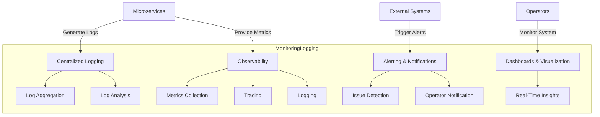

### Rationale

The design concepts focus on enhancing the system's maintainability by providing comprehensive monitoring and logging capabilities. By implementing centralized logging, enhancing observability, setting up alerting and notifications, and creating dashboards and visualization tools, the system can provide comprehensive operational insights. These design choices ensure that issues can be quickly identified and resolved, maintaining the system's reliability and ease of management throughout its lifecycle. This aligns with the maintainability quality attribute, ensuring that the system remains reliable and easy to manage over time.

---

**PAUSE for Review**: Please review the chosen design concepts and their rationale before proceeding to the next steps.

---

# Iteration 6 | Step 5

# Architecture Document

## ADD Iteration 6

### Step 5: Instantiate Elements, Define Interfaces, and Sketch Views

**Instantiation of Elements**:

1. **Centralized Logging**:
   - **Role**: Aggregates logs from all services into a single location, providing a unified view of system operations.
   - **Components**:
     - **Log Aggregation**: Collects logs from various services and stores them in a centralized repository.
     - **Log Analysis**: Provides tools for searching, filtering, and analyzing logs to identify issues and trends.
   - **Technology**: ELK Stack (Elasticsearch, Logstash, Kibana) or AWS CloudWatch Logs.

2. **Observability**:
   - **Role**: Provides a comprehensive view of system performance and health through metrics, tracing, and logging.
   - **Components**:
     - **Metrics Collection**: Gathers performance metrics from services and infrastructure.
     - **Tracing**: Tracks requests across services to identify bottlenecks and latency issues.
     - **Logging**: Captures detailed logs for troubleshooting and analysis.
   - **Technology**: Prometheus for metrics, Grafana for visualization, OpenTelemetry for distributed tracing.

3. **Alerting and Notifications**:
   - **Role**: Notifies operators of any issues or anomalies in the system.
   - **Components**:
     - **Issue Detection**: Monitors system metrics and logs for predefined thresholds and anomalies.
     - **Operator Notification**: Sends alerts to operators via email, SMS, or integration with incident management tools.
   - **Technology**: AWS CloudWatch Alarms, PagerDuty, or similar alerting tools.

4. **Dashboards and Visualization**:
   - **Role**: Provides real-time insights into system operations and performance metrics.
   - **Components**:
     - **Real-Time Insights**: Displays key performance indicators and system health metrics in an easily digestible format.
   - **Technology**: Grafana or AWS CloudWatch Dashboards.

**Interfaces**:

- **Centralized Logging Interface**:
  - `aggregateLogs(serviceLogs)`: Collects logs from various services and stores them in a centralized repository.
  - `analyzeLogs(query)`: Searches and analyzes logs to identify issues and trends.

- **Observability Interface**:
  - `collectMetrics(metricData)`: Gathers performance metrics from services and infrastructure.
  - `traceRequest(requestId)`: Tracks requests across services to identify bottlenecks and latency issues.
  - `logEvent(eventData)`: Captures detailed logs for troubleshooting and analysis.

- **Alerting and Notifications Interface**:
  - `detectIssue(metricThreshold)`: Monitors system metrics and logs for predefined thresholds and anomalies.
  - `notifyOperator(alert)`: Sends alerts to operators via email, SMS, or integration with incident management tools.

- **Dashboards and Visualization Interface**:
  - `displayMetrics(dashboardConfig)`: Displays key performance indicators and system health metrics in an easily digestible format.

**Architectural View**:

### Rationale

The instantiation of elements focuses on enhancing the system's maintainability by providing comprehensive monitoring and logging capabilities. By implementing centralized logging, enhancing observability, setting up alerting and notifications, and creating dashboards and visualization tools, the system can provide comprehensive operational insights. These design choices ensure that issues can be quickly identified and resolved, maintaining the system's reliability and ease of management throughout its lifecycle. This aligns with the maintainability quality attribute, ensuring that the system remains reliable and easy to manage over time.

---

**PAUSE for Review**: Please review the instantiated elements, defined interfaces, and architectural view before proceeding to the next steps.

---

# Iteration 6 | Step 6

# Architecture Document

## ADD Iteration 6

### Step 6: Record Design Decisions in Tables

In this step, we document the design decisions made during the refinement of the Monitoring & Logging to enhance maintainability. This includes the selection of design concepts, their implementation, and the rationale behind these choices.

#### Design Decision Table

| Decision ID | Decision Description | Rationale | Alternatives Considered | Impact |
|-------------|----------------------|-----------|-------------------------|--------|
| DD-21       | Implement Centralized Logging Solution | Aggregates logs from all services into a single location, providing a unified view of system operations. | Distributed logging without central aggregation | Improved log management, analysis, and issue detection |
| DD-22       | Enhance Observability with Metrics, Tracing, and Logging | Provides a comprehensive view of system performance and health, allowing for proactive issue identification. | Basic monitoring with limited insights | Enhanced operational insights and proactive maintenance |
| DD-23       | Set Up Alerting and Notification Mechanisms | Ensures operators are promptly informed of any issues or anomalies, enabling quick response and resolution. | Manual monitoring without automated alerts | Reduced downtime and improved system reliability |
| DD-24       | Create Dashboards and Visualization Tools | Provides real-time insights into system operations and performance metrics, facilitating proactive monitoring and decision-making. | Static reports without real-time insights | Improved decision-making and operational awareness |

### Rationale

The design decisions focus on enhancing the system's maintainability by providing comprehensive monitoring and logging capabilities. By implementing centralized logging, enhancing observability, setting up alerting and notifications, and creating dashboards and visualization tools, the system can provide comprehensive operational insights. These design choices ensure that issues can be quickly identified and resolved, maintaining the system's reliability and ease of management throughout its lifecycle. This aligns with the maintainability quality attribute, ensuring that the system remains reliable and easy to manage over time.

- **Centralized Logging**: Aggregating logs from all services into a single location simplifies log management and analysis, allowing for quicker issue detection and resolution.
- **Observability**: Integrating metrics, tracing, and logging provides a comprehensive view of system performance and health, enabling proactive issue identification and resolution.
- **Alerting and Notifications**: Setting up alerting mechanisms ensures that operators are promptly informed of any issues or anomalies, enabling quick response and resolution, minimizing downtime.
- **Dashboards and Visualization**: Creating dashboards and visualization tools provides real-time insights into system operations and performance metrics, facilitating proactive monitoring and decision-making.

These design decisions collectively enhance the system's maintainability, ensuring that it remains reliable and easy to manage throughout its lifecycle.

---

**Review Completed**: The design decisions have been recorded, ensuring alignment with the maintainability quality attribute. The system is now equipped with comprehensive monitoring and logging capabilities, providing operational insights and facilitating maintenance and management.

---

# Iteration 6 | Step 7

# Architecture Document

## ADD Iteration 6

### Step 7: Analyze the Design to Ensure Drivers are Satisfied

In this step, we analyze the design decisions made during the refinement of the Monitoring & Logging to ensure that the maintainability quality attribute is satisfied.

#### Analysis of Design Decisions

1. **Implement Centralized Logging Solution**:
   - **Analysis**: By aggregating logs from all services into a single location, the system provides a unified view of operations, simplifying log management and analysis. This allows for quicker issue detection and resolution, enhancing maintainability.
   - **Outcome**: Centralized logging supports maintainability by providing comprehensive visibility into system operations, enabling efficient troubleshooting and management.

2. **Enhance Observability with Metrics, Tracing, and Logging**:
   - **Analysis**: Integrating metrics, tracing, and logging provides a comprehensive view of system performance and health. This allows operators to gain insights into system behavior and identify potential issues before they impact users.
   - **Outcome**: Enhanced observability supports maintainability by enabling proactive issue identification and resolution, ensuring the system remains reliable and easy to manage.

3. **Set Up Alerting and Notification Mechanisms**:
   - **Analysis**: Alerting mechanisms ensure that operators are promptly informed of any issues or anomalies, enabling quick response and resolution. This minimizes downtime and maintains system reliability.
   - **Outcome**: Alerting and notifications enhance maintainability by reducing downtime and improving system reliability, ensuring that issues are addressed promptly.

4. **Create Dashboards and Visualization Tools**:
   - **Analysis**: Dashboards and visualization tools provide real-time insights into system operations and performance metrics, facilitating proactive monitoring and decision-making.
   - **Outcome**: Dashboards and visualization enhance maintainability by providing clear and actionable insights, supporting informed decision-making and operational awareness.

### Conclusion

The design decisions made during this iteration effectively address the maintainability quality attribute. By implementing centralized logging, enhancing observability, setting up alerting and notifications, and creating dashboards and visualization tools, the system is well-equipped to provide comprehensive operational insights. These design choices ensure that issues can be quickly identified and resolved, maintaining the system's reliability and ease of management throughout its lifecycle.

The enhanced monitoring and logging capabilities ensure that the system remains reliable and easy to manage over time, supporting the overall architectural goals of the Hotel Pricing System. This aligns with the maintainability quality attribute, ensuring that the system can adapt to changes and continue to operate efficiently in a cloud-native environment.

---

**Review Completed**: The analysis confirms that the maintainability quality attribute is satisfied, ensuring that the system provides comprehensive monitoring and logging capabilities. The design decisions align with the overall architectural goals and provide a robust foundation for the Hotel Pricing System.

---

# Iteration 7 | Step 2

# Iteration 7 | Step 2

# Architecture Document

## ADD Iteration 7

### Step 2: Establish Iteration Goal by Selecting Drivers

**Iteration Goal**: Enhance system security by focusing on authentication and authorization mechanisms, aligning with the security quality attribute.

**Selected Driver**: 
- **Security**: The system must ensure secure access to services, protecting sensitive data and operations from unauthorized access.

**Rationale**: 
Security is a critical aspect of the system, ensuring that only authorized users and systems can access sensitive data and operations. By focusing on authentication and authorization mechanisms, we aim to enhance the system's ability to protect against unauthorized access and ensure data integrity. This aligns with the security quality attribute, ensuring that the system remains secure and trustworthy throughout its lifecycle.

---

**PAUSE for Review**: Please review the established iteration goal and selected drivers before proceeding to the next steps.

---

# Iteration 7 | Step 3

# Iteration 7 | Step 3

# Architecture Document

## ADD Iteration 7

### Step 3: Choose Elements of the System to Refine

**Element to Refine**: Authentication and Authorization Mechanisms

**Rationale**: 
Authentication and authorization are critical components for ensuring secure access to the system's services. By refining these mechanisms, we aim to enhance the system's ability to protect sensitive data and operations from unauthorized access. This aligns with the security quality attribute, ensuring that the system remains secure and trustworthy throughout its lifecycle.

### Current State of Authentication and Authorization

- **Functionality**: Controls access to the system's services, ensuring that only authorized users and systems can perform specific operations.
- **Security Requirement**: Must ensure secure access to services, protecting sensitive data and operations from unauthorized access.
- **Current Challenges**: Potential vulnerabilities in access control mechanisms, leading to unauthorized access and data breaches.

### Refinement Focus

- **Identity and Access Management (IAM)**: Implement robust IAM solutions to manage user identities and access permissions.
- **OAuth 2.0 and OpenID Connect**: Utilize OAuth 2.0 and OpenID Connect for secure authentication and authorization, providing a standardized approach to access control.
- **Role-Based Access Control (RBAC)**: Define and enforce RBAC policies to ensure that users have access only to the resources and operations necessary for their roles.
- **Multi-Factor Authentication (MFA)**: Implement MFA to add an additional layer of security, reducing the risk of unauthorized access.

---

**PAUSE for Review**: Please review the chosen elements for refinement and the rationale before proceeding to the next steps.

---

# Iteration 7 | Step 4

# Architecture Document

## ADD Iteration 7

### Step 4: Choose Design Concepts (Patterns/Tactics)

**Design Concepts for Authentication and Authorization Refinement**:

1. **Identity and Access Management (IAM)**:
   - **Rationale**: Implementing robust IAM solutions allows for centralized management of user identities and access permissions. This enhances security by ensuring that only authorized users can access specific services and operations, aligning with the security quality attribute.

2. **OAuth 2.0 and OpenID Connect**:
   - **Rationale**: Utilizing OAuth 2.0 and OpenID Connect provides a standardized approach to secure authentication and authorization. These protocols ensure that user credentials are protected and that access tokens are used to manage permissions, enhancing security and interoperability.

3. **Role-Based Access Control (RBAC)**:
   - **Rationale**: Defining and enforcing RBAC policies ensures that users have access only to the resources and operations necessary for their roles. This minimizes the risk of unauthorized access and data breaches, supporting the security quality attribute.

4. **Multi-Factor Authentication (MFA)**:
   - **Rationale**: Implementing MFA adds an additional layer of security by requiring users to provide multiple forms of verification. This reduces the risk of unauthorized access, enhancing the overall security posture of the system.

### Design Concept Implementation

- **Identity and Access Management (IAM)**: Use cloud-native IAM solutions such as AWS IAM or Google Cloud IAM to manage user identities and access permissions centrally.
- **OAuth 2.0 and OpenID Connect**: Implement OAuth 2.0 and OpenID Connect for secure authentication and authorization, using providers like Auth0 or AWS Cognito.
- **Role-Based Access Control (RBAC)**: Define RBAC policies within the IAM solution to control access based on user roles and responsibilities.
- **Multi-Factor Authentication (MFA)**: Enable MFA for all user accounts, using solutions like Google Authenticator or AWS MFA to provide an additional layer of security.

### Architectural View

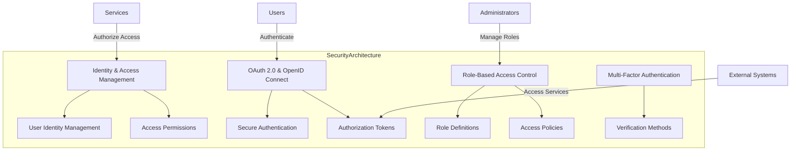

### Rationale

The design concepts focus on enhancing the system's security by refining authentication and authorization mechanisms. By implementing IAM, OAuth 2.0, OpenID Connect, RBAC, and MFA, the system can ensure secure access to services, protecting sensitive data and operations from unauthorized access. These design choices align with the security quality attribute, ensuring that the system remains secure and trustworthy throughout its lifecycle. The use of standardized protocols and cloud-native solutions further enhances the system's ability to operate securely in a cloud environment, supporting the overall architectural goals.

---

**PAUSE for Review**: Please review the chosen design concepts and their rationale before proceeding to the next steps.

---

# Iteration 7 | Step 5

# Architecture Document

## ADD Iteration 7

### Step 5: Instantiate Elements, Define Interfaces, and Sketch Views

**Instantiation of Elements**:

1. **Identity and Access Management (IAM)**:
   - **Role**: Manages user identities and access permissions centrally, ensuring secure access to services.
   - **Components**:
     - **User Identity Management**: Handles user registration, authentication, and profile management.
     - **Access Permissions**: Defines and enforces access policies based on user roles and permissions.
   - **Technology**: AWS IAM, Google Cloud IAM, or similar cloud-native IAM solutions.

2. **OAuth 2.0 and OpenID Connect**:
   - **Role**: Provides secure authentication and authorization using standardized protocols.
   - **Components**:
     - **Secure Authentication**: Authenticates users and issues access tokens.
     - **Authorization Tokens**: Manages access tokens to control permissions and access to services.
   - **Technology**: Auth0, AWS Cognito, or similar identity providers.

3. **Role-Based Access Control (RBAC)**:
   - **Role**: Controls access to resources and operations based on user roles and responsibilities.
   - **Components**:
     - **Role Definitions**: Defines roles and associated permissions.
     - **Access Policies**: Enforces access control policies based on roles.
   - **Technology**: Integrated within IAM solutions.

4. **Multi-Factor Authentication (MFA)**:
   - **Role**: Adds an additional layer of security by requiring multiple forms of verification.
   - **Components**:
     - **Verification Methods**: Supports various MFA methods such as SMS, email, or authenticator apps.
   - **Technology**: Google Authenticator, AWS MFA, or similar MFA solutions.

**Interfaces**:

- **IAM Interface**:
  - `registerUser(userData)`: Registers a new user and creates an identity profile.
  - `authenticateUser(credentials)`: Authenticates a user and issues an access token.
  - `authorizeAccess(token, resource)`: Verifies access permissions for a given resource.

- **OAuth 2.0 and OpenID Connect Interface**:
  - `requestToken(clientId, clientSecret)`: Requests an access token for a client application.
  - `validateToken(token)`: Validates an access token and retrieves associated permissions.

- **RBAC Interface**:
  - `defineRole(roleName, permissions)`: Defines a new role with associated permissions.
  - `assignRole(userId, roleName)`: Assigns a role to a user.

- **MFA Interface**:
  - `enableMFA(userId, method)`: Enables MFA for a user with a specified verification method.
  - `verifyMFA(userId, code)`: Verifies the MFA code provided by the user.

**Architectural View**:

### Rationale

The instantiation of elements focuses on enhancing the system's security by refining authentication and authorization mechanisms. By implementing IAM, OAuth 2.0, OpenID Connect, RBAC, and MFA, the system can ensure secure access to services, protecting sensitive data and operations from unauthorized access. These design choices align with the security quality attribute, ensuring that the system remains secure and trustworthy throughout its lifecycle. The use of standardized protocols and cloud-native solutions further enhances the system's ability to operate securely in a cloud environment, supporting the overall architectural goals.

---

**PAUSE for Review**: Please review the instantiated elements, defined interfaces, and architectural view to ensure alignment with the security quality attribute before proceeding to the next steps.

---

# Iteration 7 | Step 6

# Architecture Document

## ADD Iteration 7

### Step 6: Record Design Decisions in Tables

In this step, we document the design decisions made during the refinement of the Authentication and Authorization mechanisms to enhance security. This includes the selection of design concepts, their implementation, and the rationale behind these choices.

#### Design Decision Table

| Decision ID | Decision Description | Rationale | Alternatives Considered | Impact |
|-------------|----------------------|-----------|-------------------------|--------|
| DD-25       | Implement Identity and Access Management (IAM) | Centralizes management of user identities and access permissions, ensuring secure access to services. | Decentralized access control without centralized management | Improved security, manageability, and access control |
| DD-26       | Utilize OAuth 2.0 and OpenID Connect for Authentication and Authorization | Provides a standardized approach to secure authentication and authorization, protecting user credentials and managing permissions. | Custom authentication protocols without standardization | Enhanced security, interoperability, and user experience |
| DD-27       | Define and Enforce Role-Based Access Control (RBAC) Policies | Ensures users have access only to the resources and operations necessary for their roles, minimizing unauthorized access. | Ad-hoc access control without role definitions | Improved security, compliance, and access management |
| DD-28       | Implement Multi-Factor Authentication (MFA) | Adds an additional layer of security by requiring multiple forms of verification, reducing the risk of unauthorized access. | Single-factor authentication without additional verification | Enhanced security and reduced risk of unauthorized access |

### Rationale

The design decisions focus on enhancing the system's security by refining authentication and authorization mechanisms. By implementing IAM, OAuth 2.0, OpenID Connect, RBAC, and MFA, the system can ensure secure access to services, protecting sensitive data and operations from unauthorized access. These design choices align with the security quality attribute, ensuring that the system remains secure and trustworthy throughout its lifecycle.

- **Identity and Access Management (IAM)**: Centralizing management of user identities and access permissions enhances security by ensuring that only authorized users can access specific services and operations.
- **OAuth 2.0 and OpenID Connect**: Utilizing standardized protocols for authentication and authorization protects user credentials and manages permissions securely, enhancing interoperability and user experience.
- **Role-Based Access Control (RBAC)**: Defining and enforcing RBAC policies ensures that users have access only to the resources and operations necessary for their roles, minimizing the risk of unauthorized access.
- **Multi-Factor Authentication (MFA)**: Implementing MFA adds an additional layer of security by requiring users to provide multiple forms of verification, reducing the risk of unauthorized access.

These design decisions collectively enhance the system's security, ensuring that it remains secure and trustworthy throughout its lifecycle. The use of standardized protocols and cloud-native solutions further enhances the system's ability to operate securely in a cloud environment, supporting the overall architectural goals.

---

**Review Completed**: The design decisions have been recorded, ensuring alignment with the security quality attribute. The system is now equipped with robust authentication and authorization mechanisms, providing secure access to services and protecting sensitive data and operations from unauthorized access.

---

# Iteration 7 | Step 7

# Architecture Document

## ADD Iteration 7

### Step 7: Analyze the Design to Ensure Drivers are Satisfied

In this step, we analyze the design decisions made during the refinement of the Authentication and Authorization mechanisms to ensure that the security quality attribute is satisfied.

#### Analysis of Design Decisions

1. **Implement Identity and Access Management (IAM)**:
   - **Analysis**: Centralizing the management of user identities and access permissions through IAM solutions ensures that only authorized users can access specific services and operations. This enhances security by providing a single point of control for access management, reducing the risk of unauthorized access.
   - **Outcome**: IAM supports the security quality attribute by ensuring secure access to services, protecting sensitive data and operations from unauthorized access.

2. **Utilize OAuth 2.0 and OpenID Connect for Authentication and Authorization**:
   - **Analysis**: Utilizing OAuth 2.0 and OpenID Connect provides a standardized approach to secure authentication and authorization. These protocols protect user credentials and manage permissions securely, enhancing interoperability and user experience.
   - **Outcome**: OAuth 2.0 and OpenID Connect enhance security by ensuring that user credentials are protected and that access tokens are used to manage permissions, aligning with the security quality attribute.

3. **Define and Enforce Role-Based Access Control (RBAC) Policies**:
   - **Analysis**: Defining and enforcing RBAC policies ensures that users have access only to the resources and operations necessary for their roles. This minimizes the risk of unauthorized access and data breaches, supporting the security quality attribute.
   - **Outcome**: RBAC enhances security by ensuring that access is granted based on user roles and responsibilities, reducing the risk of unauthorized access.

4. **Implement Multi-Factor Authentication (MFA)**:
   - **Analysis**: Implementing MFA adds an additional layer of security by requiring users to provide multiple forms of verification. This reduces the risk of unauthorized access, enhancing the overall security posture of the system.
   - **Outcome**: MFA enhances security by providing an additional layer of protection, ensuring that access is granted only to authorized users, supporting the security quality attribute.

### Conclusion

The design decisions made during this iteration effectively address the security quality attribute. By implementing IAM, OAuth 2.0, OpenID Connect, RBAC, and MFA, the system is well-equipped to ensure secure access to services, protecting sensitive data and operations from unauthorized access. These design choices ensure that the system remains secure and trustworthy throughout its lifecycle.

The enhanced authentication and authorization mechanisms ensure that the system can protect against unauthorized access and ensure data integrity, supporting the overall architectural goals of the Hotel Pricing System. This aligns with the security quality attribute, ensuring that the system can operate securely in a cloud-native environment.

---

**Review Completed**: The analysis confirms that the security quality attribute is satisfied, ensuring that the system provides robust authentication and authorization mechanisms. The design decisions align with the overall architectural goals and provide a secure foundation for the Hotel Pricing System.